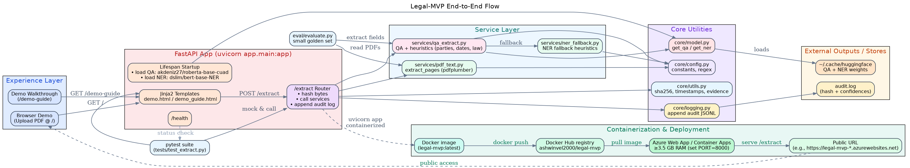
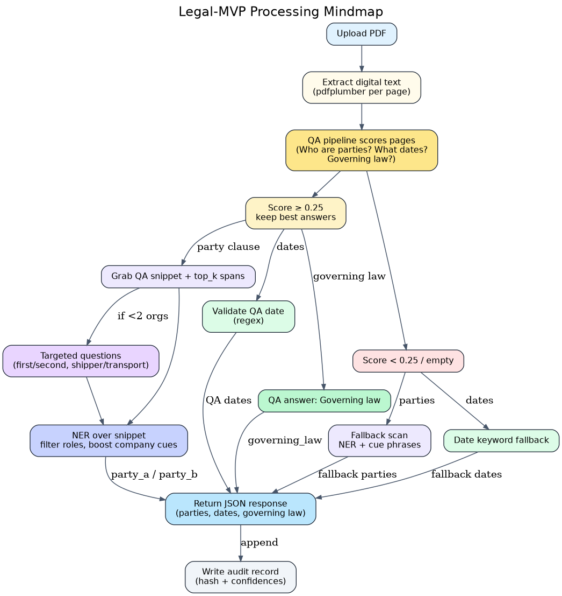

<h1 align="center">Legal-MVP</h1>

<p align="center">
  <em> Contract intelligence from PDF upload to Azure-hosted demo.</em>
</p>

<p align="center">
  
</p>

##  What’s inside

- **FastAPI service** that turns digitally generated contract PDFs into structured facts:
  - `party_a`, `party_b`
  - `effective_date`, `agreement_date`
  - `governing_law`
- **Hybrid extraction pipeline**
  - QA model: `akdeniz27/roberta-base-cuad`
  - NER fallback: `dslim/bert-base-NER`
  - PDF text via `pdfplumber`
- **Management demo UI** – upload a PDF, watch the entities appear, inspect provenance.
- **Audit trail** – each extraction logs file hash + confidences (no document text stored).
- **Dockerized & Azure-ready** – the exact image powering the live demo.


---

##  How the workflow runs

1. **PDF upload** → FastAPI receives the file and hashes it.
2. **Text extraction** → `pdfplumber` reads page-by-page text.
3. **QA first pass** → Hugging Face QA pinpoints clauses.
4. **NER & heuristics** → organization names are cleaned up, dates validated, governing law returned if present.
5. **Response + audit** → JSON sent back to the UI, audit line appended to `audit.log`.

<p align="center">
  
</p>

---

##  Quickstart (local)

```bash
python -m venv .venv
source .venv/bin/activate
pip install -r requirements.txt
uvicorn app.main:app --host 0.0.0.0 --port 8000 --reload
```

Open `http://localhost:8000/` and upload a digital PDF. For API docs, visit `http://localhost:8000/docs`.

### Via Docker

```bash
DOCKER_BUILDKIT=1 docker build -t legal-mvp .
docker run --rm -p 8000:8000 legal-mvp
```

---

##  Deployment snapshot

1. Build the container with the bundled Dockerfile (Python 3.11 slim).
2. Push to Docker Hub (`ashwinvel2000/legal-mvp`).
3. Deploy to Azure Web App for Containers (set `PORT=8000`).
4. First run warms the Hugging Face models; subsequent requests are fast.

> Bonus: `core/logging.append_audit` writes JSON lines like:
> ```json
> {"file_sha256": "…", "timestamp_utc": "…", "fields": [{"field": "party_a", "confidence": 0.94}, …]}
> ```

---

##  Mini evaluation

Hand-label a few public NDAs in `eval/golden.jsonl`, drop the PDFs into `data/samples/`, then run:

```bash
python eval/evaluate.py
```

You’ll get per-field precision/recall across the tiny golden set.

---

##  Project anatomy

```
app/         # FastAPI app + demo templates
core/        # Config, model loaders, utilities, audit logging
services/    # PDF text, QA/NER extraction, fallback heuristics
eval/        # Micro evaluation harness
docs/        # Architecture, process, and manager-friendly diagrams
```

---

##  Roadmap

- Expand party extraction via fine-tuned legal NER (reduce heuristics).
- Add OCR/layout parsing for scanned documents.
- Harden evaluation with a larger labelled set + CI check.
- Instrument Azure app with application insights + error alerts.

---

Built in 7 days to mirror real-world legal ops: pragmatic ML, clean FastAPI surface, cloud-ready delivery.
